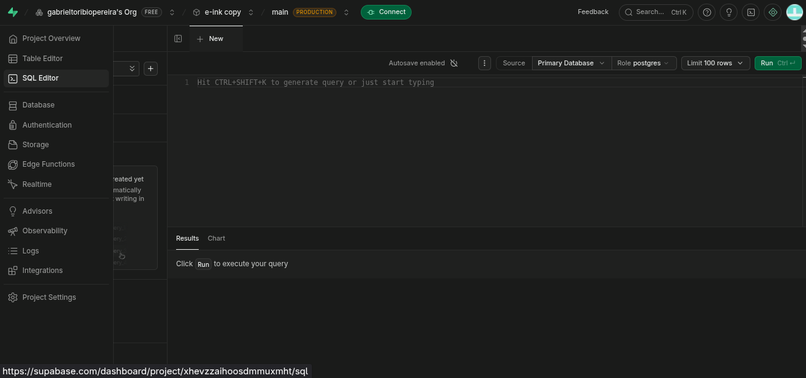
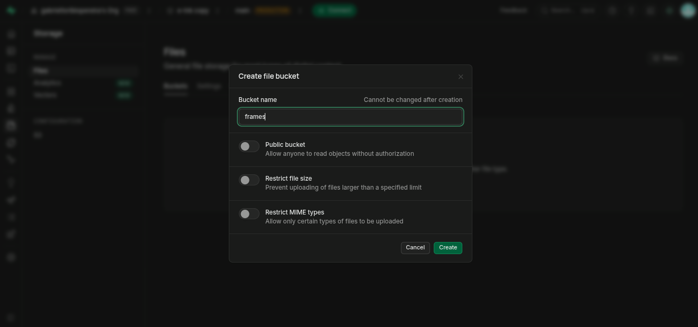
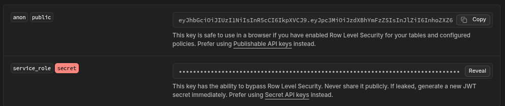

# e-ink display

A 7.5" e-paper dashboard that shows the time, the weather, my google calendar, my
google tasks and my habit tracker. An ESP32 wakes up, downloads the image and goes
back to sleep.

# Components

| | |
|---|---|
| Universal e-Paper Raw Panel Driver Board, ESP32 WiFi / Bluetooth Wireless | $14.99 |
| 800×480, 7.5inch E-Ink display HAT for Raspberry Pi | $56.99 |
| Battery | ~$10 |
| TTP223 (10 units, you'll only use 4) | $1.65 |
| Frame | $3-6 |
| Cables | |

# Explanation

I'll explain some of the tecnical desicions.

First of all I decided to use an esp32 instead of a raspberry pi zero 2 because the
esp32 in its sleep mode consumes so much less electricity.

You can replace the TTP223 for buttons or wathever you like.

The hour will not refresh automaticly because I rather save battery, you have to
wake it first (its not programmed yet because i dont have the esp32 yet).

E-ink keeps the image with **zero power**, that's the whole point. It only costs
battery when it changes. So the esp32 sleeps, wakes up every X minutes, asks if
there is anything new, and only redraws when the image actually changed.

The web renders the screens, a script turns them into a 2 bits per pixel image
(4 grays, 96000 bytes exactly) and the esp32 downloads that raw file. It can't use
a `.h` file because it can't compile anything at runtime, and the `.h` is 6 times
bigger anyway (600KB of text for 96KB of data).

# How to install

If you want to replicate the e-ink display there's a lot of thing you need to do.
I'll try my best to explain.

First of all install the repository:

```bash
git clone https://github.com/gabrieltoribiopereira/e-ink-display.git
cd e-ink-display

python3 -m venv .venv
.venv/bin/pip install -r scripts/requirements.txt

cd server && npm ci && npx playwright install --with-deps chromium && cd ..
```

If you are on Arch (or anything that is not Debian/Ubuntu) drop the `--with-deps`,
it uses apt-get behind the scenes so it will fail:

```bash
cd server && npm ci && npx playwright install chromium && cd ..
```

# Supabase

You'll need an account on supabase.com. First of all create a project.

### Create your user

Authentication -> Users -> **Add user**. Write down the email and the password,
you'll need them later. There is no sign up form in the web on purpose, it's only
for me.

### Create the tables

Once the project is created go to SQL editor

paste and execute the following code:

```sql
create table habitos (
  usuario uuid primary key references auth.users(id) on delete cascade,
  datos jsonb not null default '{"habitos":[],"registro":{}}',
  actualizado timestamptz default now()
);
create table ajustes (
  usuario uuid primary key references auth.users(id) on delete cascade,
  ics text, lat numeric default 41.6, lon numeric default 2.3
);
create table tareas (
  usuario uuid primary key references auth.users(id) on delete cascade,
  datos jsonb not null default '[]',
  actualizado timestamptz default now()
);

alter table habitos enable row level security;
alter table ajustes enable row level security;
alter table tareas  enable row level security;

create policy "solo lo mio" on habitos for all
  using (auth.uid() = usuario) with check (auth.uid() = usuario);
create policy "solo lo mio" on ajustes for all
  using (auth.uid() = usuario) with check (auth.uid() = usuario);
create policy "solo lo mio" on tareas for all
  using (auth.uid() = usuario) with check (auth.uid() = usuario);
```

The `enable row level security` part is not optional. The anon key is public (it
goes inside config.js and anyone can read it), so those policies are the only thing
stopping other people from reading your habits and tasks.

### Create the bucket

Storage -> New bucket -> name it `frames`. **Turn OFF the "Public bucket" switch**,
the frames are pictures of your calendar and your tasks.


### Save the keys

Project Settings -> API Keys -> save these two (the `service_role` one is inside
the "Legacy API keys" tab):


Project Settings -> Data API -> save the Project URL. If you can't find it, it's
always `https://<project-ref>.supabase.co` and the ref is in the url of the
dashboard.

# Google

You will need google credentials to use the calendar and the tasks.

### The calendar url

Google Calendar -> my calendars -> 3 dots -> Settings -> **Integrate calendar** ->
copy the **secret address in iCal format**.

Careful with this one, that url is the key to your whole calendar. Anyone who has
it can read all your events without any password.

### The OAuth credentials

console.cloud.google.com -> new project -> **enable the Google Tasks API** first.

Then OAuth consent screen -> **publish the app**. If you leave it in "Testing"
google kills your token every 7 days and the cron stops syncing (it happened to me).

Then Credentials -> Create credentials -> OAuth client ID -> **type: Desktop app**.
The type matters, gtasks.py uses InstalledAppFlow and it only works with Desktop.

Click on the client you just created and hit **Download JSON**. You need the whole
file, not just the client ID.

# The secrets folder

This folder is in .gitignore, that's why you don't see it in the repo. You have to
create it:

```bash
mkdir -p secrets

# the OAuth json you downloaded from google
cp ~/Downloads/client_secret_*.json secrets/credentials.json

# the account the screenshot browser uses to log in.
# same email and password of the supabase user you created before
cat > secrets/display.json <<'EOF'
{"email": "you@example.com", "password": "..."}
EOF

# the ESP32 password. You invent this one, nobody gives it to you
python3 -c "import secrets; print(secrets.token_urlsafe(32))" > secrets/device-token.txt
```

And `secrets/config.js`, which is the one the web reads:

```js
const CONFIG = {
  ICS: "https://calendar.google.com/calendar/ical/.../basic.ics",
  LAT: 41.6,
  LON: 2.3,
  SUPABASE_URL: "https://xxxx.supabase.co",
  SUPABASE_ANON_KEY: "eyJ...",
};
```

There is a template in `web/config.example.js` if you prefer to copy that one.

### Authorize google (only once)

```bash
.venv/bin/python scripts/gtasks.py
```

It opens the browser, you accept, and it creates `secrets/token.json`. From then on
it refreshes by itself, you don't have to authorize again.

# Configure weather

Put your latitude and longitude in `secrets/config.js` (LAT and LON, up there). You
get them from google maps, right click anywhere and it copies them.

The first time you log in, the web copies those values into the `ajustes` table of
supabase and **from then on it reads them from there**, not from config.js. That's
because the ICS url can't live in config.js: that file is served without login, so
on netlify anybody could open /config.js and read your whole calendar.

So if you want to change the location later, config.js will do nothing, you have to
change the table:

```sql
update ajustes set lat = 40.4168, lon = -3.7038;
```

(I named the file ajustes.js instead of settings.js and I don't want to rename it
now that everything works XD, for the next project I'll do everything in english
from the start)

# Github secrets

This part is only if you want it running in the cloud, so the display keeps working
with your computer turned off. Github actions renders the screens every 20 minutes
and uploads them to supabase.

Go to your repo -> Settings -> Secrets and variables -> Actions -> New repository
secret, and create these nine:

| Secret | Where you get it |
|---|---|
| `SUPABASE_URL` | the Project URL from before |
| `SUPABASE_ANON_KEY` | the anon key |
| `SUPABASE_SERVICE_ROLE` | the service_role key (the one that warns about RLS) |
| `CAL_ICS` | the secret iCal url |
| `DISPLAY_EMAIL` | the email of the supabase user |
| `DISPLAY_PASSWORD` | its password |
| `GOOGLE_CREDENTIALS` | the whole content of `secrets/credentials.json` |
| `GOOGLE_TOKEN` | the whole content of `secrets/token.json` |
| `DEVICE_TOKEN` | the same one you put in `secrets/device-token.txt` |

The name goes in the **Name** field (only letters, numbers and `_`, that's why it
rejects an `@`) and the value in the big box below.

# The edge function

The frames bucket is private, so the esp32 can't read it directly. This function
checks its token and gives it the file:

```bash
npx supabase login
npx supabase link --project-ref YOUR_REF
npx supabase secrets set DEVICE_TOKEN=<the same one you generated before>
npx supabase functions deploy frame --no-verify-jwt
```

`--no-verify-jwt` is mandatory. The esp32 has no supabase session, so if you leave
the jwt check on, supabase rejects the request before it even reaches the code.

I didn't give the esp32 the supabase keys on purpose. If someone steals the device
the only thing they can do is download 4 pictures, not read my database.

# Deploy via netlify

netlify.com -> Add new site -> Import an existing project -> github -> pick the repo.

**Don't touch** the build command or the publish directory, netlify reads them from
`netlify.toml`.

Before deploying, go to Environment variables and add two:

- `SUPABASE_URL`
- `SUPABASE_ANON_KEY` -> the **anon** one, not the service role

If you paste the wrong one the build fails on purpose with "SUPABASE_ANON_KEY parece
la clave de servicio". I put that check there because that key skips RLS and
publishing it in a static file gives anybody full access to the database.

Then hit Deploy. From now on every git push deploys by itself.

Netlify does **not** replace github actions. The frames still need a real chromium
rendering them and netlify only serves files. Netlify is so I can open the dashboard
from my phone.

# Run it

Now that everything is set up:

```bash
cd server
npm start        # everything: web + chromium + screenshots
npm run web      # only the web, starts instantly, no screenshots
```

Open http://localhost:8002 and log in with the supabase user. Use `npm run web` when
you are just editing the web, it doesn't launch chromium so it's way faster.

Press a button and save the image it returns (this goes in another terminal, change
the x for the button number):

```bash
curl -s -X POST -d 'x' http://localhost:8002/boton -o prueba.png

# see the current screen without pressing anything
curl -s http://localhost:8002/captura.png -o actual.png
```

To test what the esp32 will do:

```bash
.venv/bin/python scripts/simular-esp32.py 1    # press button 1
python3 scripts/ver-bin.py esp32-sim/inicio.bin --abrir
```

Run the same button twice. The second time it should say "sin cambios" and not
download anything, that's the hash check that saves the battery.

Only from the `inicio` screen you can jump to another screen. From the rest, button
1 takes you back and the others do things inside that screen.

If the port gets stuck: `fuser -k 8002/tcp`

---

If there is something about I wast clear enough let me know please. I wrote the
readme after finish the project so I may had forget some steps.
